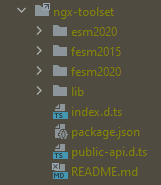

# NgxToolset
Opinionated Angular library that contains common tools and patterns to simplify things and reuse code.

This library was generated with [Angular CLI](https://github.com/angular/angular-cli) version 14.1.0, so all projects that use this library must have Angular version numbers >= 14.1.0.

The package is published at https://www.npmjs.com/package/@aheadlabs/ngx-toolset

## Contributing
### .npmrc file
This file in `projects/ngx-toolset` contains configuration information for the npm package manager (more info at https://docs.npmjs.com/cli/v8/configuring-npm/npmrc).

In order to authenticate against npm you would need a valid token in an environment variable called NPM_TOKEN. That way npm CLI will find it through the .npmrc file.

### Code scaffolding
To add a new component run `ng generate component component-name --project ngx-toolset` to generate a new component. You can also use `ng generate directive|pipe|service|class|guard|interface|enum|module --project ngx-toolset`.
> Note: Don't forget to add `--project ngx-toolset` or else it will be added to the default project in your `angular.json` file. 

### package.json and version numbers
The package.json file at `/` is only for the workspace, NOT for the library.
> Remember to update version numbers, dependencies and any other package configuration related to the library at `/projects/ngx-toolset/package.json` file.

### Building the library
You can build the library from the root `/` or from the library root `/projects/ngx-toolset/`.

#### From root
Run `npm run build-library` to build the project and copy the .npmrc file to the `/dist/` directory.

#### From library root
Run `npm run build` to build the project and copy the .npmrc file to the `/dist/` directory.

### Developer tips

#### How to install the library locally

In order to test the behaviour of the library when developing new features, you can install the library from your local workspace using:

`npm install [your_test_project_location]/ngx-toolset/dist/ngx-toolset --save`

#### How to check if your test project is using the library locally

To check if the library is being tested from your local code, you can check the package.json and see your local directory in the library package, under `dependencies`:

`"@aheadlabs/ngx-toolset": "file:[your_test_project_location]/_ngx-toolset/dist/ngx-toolset"`

Or from `node_modules` folder, a  icon over the package will point that the package is being used locally:

> Note: Don't forget to inject the modules you need into the correspondant module on your project. Otherwise you will not be able to use the library.

## Publishing
After building your library with `ng build ngx-toolset`, go to the dist folder `cd dist/ngx-toolset` and run `npm publish`.

Please, refer to the [.npmrc file section](#npmrc-file) earlier in this document.

## Running unit tests
Run `ng test ngx-toolset` to execute the unit tests via [Karma](https://karma-runner.github.io).

## Troubleshooting

| Problem                                                                                                                                                                                              | Solution |
|------------------------------------------------------------------------------------------------------------------------------------------------------------------------------------------------------|----------|
 | When installing the library locally (for developing purposes), an error is shown in the browser's developer console: `ERROR TypeError: Cannot read properties of null (reading 'bindingStartIndex')` | You have to activate the preservation of symlinks. Open angular.json file and find options in build in architect and add `"preserveSymlinks": true`

## Further help
To get more help on the Angular CLI use `ng help` or go check out the [Angular CLI Overview and Command Reference](https://angular.io/cli) page.
